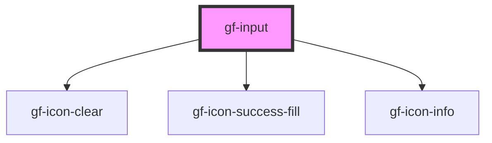

# gf-input

<!-- Auto Generated Below -->

## Properties

| Property       | Attribute        | Description | Type                                                | Default      |
| -------------- | ---------------- | ----------- | --------------------------------------------------- | ------------ |
| `autofocus`    | `autofocus`      |             | `boolean`                                           | `false`      |
| `autosize`     | `autosize`       |             | `boolean`                                           | `false`      |
| `clearable`    | `clearable`      |             | `boolean`                                           | `false`      |
| `disabled`     | `disabled`       |             | `boolean`                                           | `false`      |
| `iconColor`    | `icon-color`     |             | `string`                                            | `'#ccc'`     |
| `iconFontSize` | `icon-font-size` |             | `number`                                            | `20`         |
| `maxRows`      | `max-rows`       |             | `number \| string`                                  | `undefined`  |
| `maxlength`    | `maxlength`      |             | `number`                                            | `undefined`  |
| `minRows`      | `min-rows`       |             | `number \| string`                                  | `undefined`  |
| `placeholder`  | `placeholder`    |             | `string`                                            | `undefined`  |
| `resize`       | `resize`         |             | `string`                                            | `'vertical'` |
| `rows`         | `rows`           |             | `number \| string`                                  | `2`          |
| `status`       | `status`         |             | `"" \| "error" \| "info" \| "success" \| "warning"` | `''`         |
| `type`         | `type`           |             | `string`                                            | `'text'`     |
| `value`        | `value`          |             | `string`                                            | `''`         |

## Events

| Event         | Description | Type                           |
| ------------- | ----------- | ------------------------------ |
| `eventBlur`   |             | `CustomEvent<HTMLAreaElement>` |
| `eventChange` |             | `CustomEvent<string>`          |
| `eventClear`  |             | `CustomEvent<string>`          |
| `eventFocus`  |             | `CustomEvent<FocusEvent>`      |
| `eventInput`  |             | `CustomEvent<string>`          |

## Dependencies

### Depends on

- [gf-icon-clear](../../../../sten-icons/src/components)
- [gf-icon-success-fill](../../../../sten-icons/src/components)
- [gf-icon-info](../../../../sten-icons/src/components)

### Graph

----------------------------------------------

*Built with [StencilJS](https://stenciljs.com/)*
