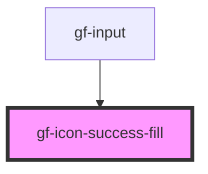

# gf-icon-success-fill

<!-- Auto Generated Below -->

## Properties

| Property  | Attribute | Description | Type               | Default     |
| --------- | --------- | ----------- | ------------------ | ----------- |
| `color`   | `color`   |             | `string`           | `"#606266"` |
| `opacity` | `opacity` |             | `number \| string` | `1`         |
| `rotate`  | `rotate`  |             | `number`           | `0`         |
| `size`    | `size`    |             | `number \| string` | `30`        |
| `spin`    | `spin`    |             | `boolean`          | `false`     |
| `styles`  | --        |             | `object`           | `{}`        |

## Dependencies

### Used by

 - [gf-input](../../../sten-components/src/components/gf-input)

### Graph

----------------------------------------------

*Built with [StencilJS](https://stenciljs.com/)*
